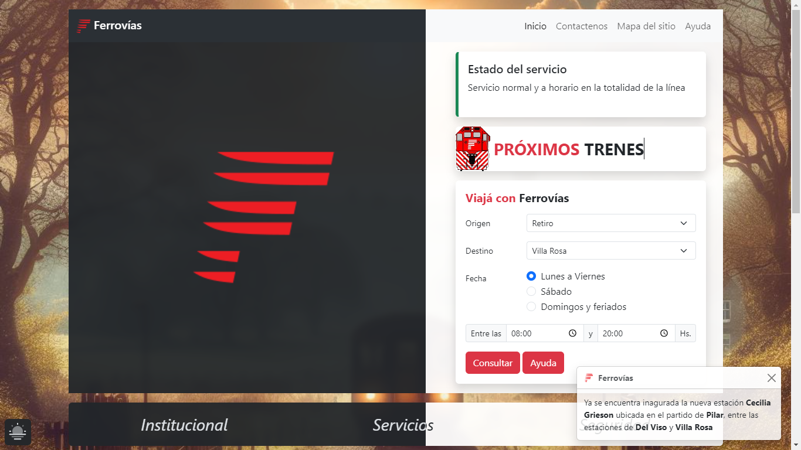

# Ferrovías (DEMO)

En sus 2 versiones Dark/Light

Como empresa dedicada al transporte ferroviario, **Ferrovías** ha sido un pilar importante en la industria durante décadas. Sin embargo, entendemos que la presencia en línea de la empresa necesita una actualización para reflejar su posición como líder en el sector de una manera más contemporánea y funcional.

Una de la propuesta de renovación respeta la herencia y la historia de Ferrovías mientras moderniza la experiencia del usuario y la estética del sitio web. Aquí hay un resumen de los cambios que proponemos:

**Diseño Responsivo**: He diseñado el nuevo sitio web para que sea totalmente responsive, lo que significa que se adaptará perfectamente a cualquier dispositivo, ya sea un movil, una tablet, una laptop o una computadora de escritorio. Esto garantiza una experiencia de usuario consistente y atractiva, independientemente del dispositivo utilizado.

**Navegación Intuitiva**: Simplificamos la estructura de navegación del sitio para que los usuarios puedan encontrar la información que necesitan de manera más rápida y sencilla. Menús claros y categorías bien definidas facilitan la búsqueda de horarios, rutas, tarifas y cualquier otra información relevante.

**Diseño Moderno y Atractivo**: Manteniendo los colores corporativos de Ferrovías, hemos actualizado el diseño del sitio para que sea más moderno y visualmente atractivo. Incorporamos elementos visuales dinámicos y fotografías de alta calidad para mejorar la estética general y transmitir la calidad y profesionalismo de los servicios de Ferrovías.

**Sección de Noticias y Actualizaciones**: Agregamos una sección dedicada a noticias y actualizaciones relacionadas con Ferrovías, donde los usuarios pueden mantenerse al día con las últimas novedades, eventos y promociones de la empresa.

En resumen, la propuesta de renovación para el sitio web de Ferrovías busca mejorar la experiencia del usuario, modernizar la imagen de la empresa y mantenerla a la vanguardia en un mercado cada vez más competitivo. Creemos que estos cambios ayudarán a Ferrovías a seguir siendo líder en el transporte ferroviario, atrayendo a nuevos clientes y fidelizando a los existentes, sin perder de vista su rica historia y legado en la industria.